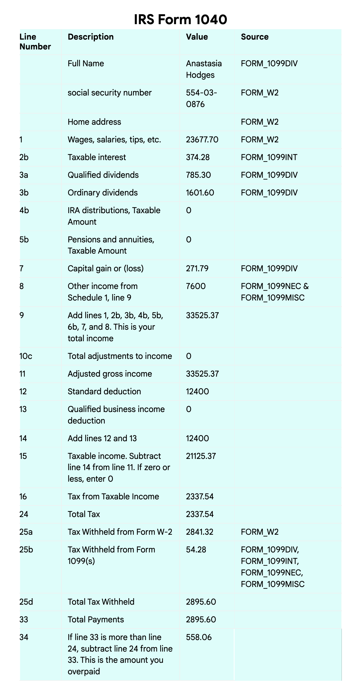
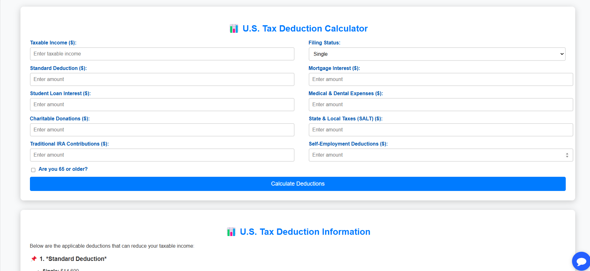

# Tax Assistant
This project simplifies the income tax filing process by automating document extraction, deduction calculations, and tax-related queries. It leverages Google Cloud Document AI to parse tax forms, a Tax Deductions Calculator to compute eligible deductions, and a Tax Bot trained on IRS Tax Guide to answer user queries.

Key Features
-> Automated Tax Document Processing – Extracts data from W-2, 1099-DIV, 1099-INT, 1099-MISC, and 1099-NEC forms using Google Cloud Document AI
-> Tax Deductions Calculator – Computes deductions based on IRS guidelines
-> Tax Bot – Provides tax-related assistance using AI trained on the IRS Tax Guide
-> Firestore Integration – Stores extracted tax data securely
-> Deployed on Google Cloud Run – Easily scalable for real-world usage

How It Works
1️. Upload tax documents – Automatically extracts relevant financial data
2️. View saved data – Processed information aligns with IRS tax return forms
3️. Calculate tax deductions – Enter income and expenses to compute eligible deductions
4️. Ask tax-related queries – The AI-powered bot provides accurate tax guidance

Technologies Used
  Google Cloud Document AI – Parses and extracts tax document data
 Firestore – Stores tax-related data
 Flask & Python – Backend processing
 Natural Language Processing (NLP) – Trained tax bot for answering user queries
 Google Cloud Run – For scalable deployment


## Setup

### Dependencies

1. [Install Python](https://www.python.org/downloads/)
2. Install the [Google Cloud SDK](https://cloud.google.com/sdk/docs/install)
3. Install the prerequisites:
   - `pip install -r requirements.txt`
4. Run `gcloud init`, create a new project, and
   [enable billing](https://cloud.google.com/billing/docs/how-to/modify-project#enable_billing_for_a_project)
5. Enable the Document AI API:
   - `gcloud services enable documentai.googleapis.com`
6. Setup application default authentication, run:
   - `gcloud auth application-default login`
7. Create a Firestore Database in Native Mode
   - `gcloud firestore databases create`

### Demo Deployment

1. Create a `config.yaml` with the following format

   ```yaml
   docai_processor_location: us # Document AI Processor Location (us OR eu)
   docai_project_id: YOUR_PROJECT_ID # Project ID for Document AI Processors
   firestore:
     collection: tax_documents # Set with your preferred Firestore Collection Name
     project_id: YOUR_PROJECT_ID # Project ID for Firestore Database
   docai_active_processors:
   ```

2. Run setup scripts to create the processors and Cloud Run app in your project.
   - `python3 setup.py`
   - `gcloud run deploy tax-demo --source .`
3. Visit the deployed web page
4. Upload Sample Documents
   - Currently supports the following Document Types (2020 Editions)
     - `W-2`
     - `1099-DIV`
     - `1099-INT`
     - `1099-MISC`
     - `1099-NEC`
5. Click "Upload" Button, wait for processing to complete
6. Click "View Saved Data" to see the tax calculation output
   - This output is designed to match up with the 2020 `1040` US Tax Return Form
7. Tax Deductions Calculator

   Navigate to the Tax Deductions Calculator section
   Enter financial details such as income, expenses, and deductions
   Click "Calculate Deductions" to view eligible deductions based on IRS guidelines
8. Tax Bot for Queries

   Go to the Tax Bot section
   Ask tax-related questions (e.g., "What deductions can I claim?" or "How do I report freelance income?")
   The bot provides responses based on the IRS Tax Guide





